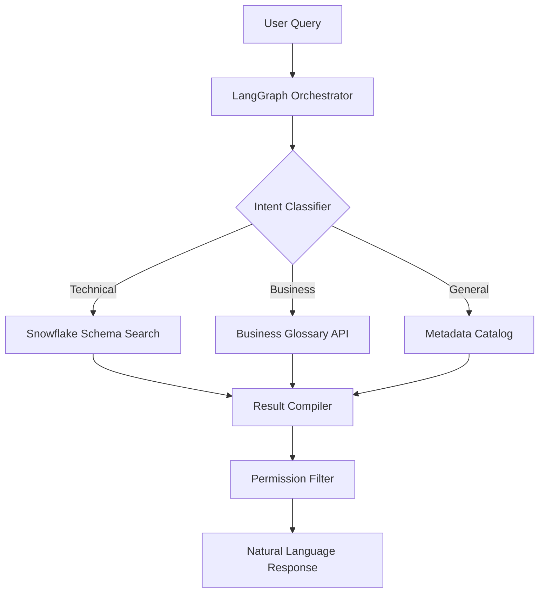

# Project 1: LangGraph Metadata Discovery Agent
## Pepper Money (2024)

### Executive Summary
Built an AI-powered conversational agent that reduced data discovery time from **2-3 hours to 5-10 minutes** using LangGraph orchestration and Claude 3 Sonnet.

### Problem Statement
- Data analysts spent hours searching through Snowflake schemas, metadata catalogs, and business glossaries
- No unified interface for data discovery across multiple systems
- Manual processes led to inconsistent results and compliance risks

### Solution Architecture



### Key Implementation Details

```python
class MetadataDiscoveryAgent:
    def __init__(self):
        self.llm = BedrockChat(model="anthropic.claude-3-sonnet")
        self.graph = self._build_graph()

    def _build_graph(self):
        workflow = StateGraph(AgentState)

        # Add nodes with specific capabilities
        workflow.add_node("classify_intent", self.classify_intent)
        workflow.add_node("search_snowflake", self.search_snowflake)
        workflow.add_node("search_catalog", self.search_catalog)
        workflow.add_node("compile_results", self.compile_results)

        # Conditional routing based on intent
        workflow.add_conditional_edges(
            "classify_intent",
            self._route_by_intent,
            {
                "technical": "search_snowflake",
                "business": "search_glossary",
                "general": "search_catalog"
            }
        )

        return workflow.compile()
```

### Impact Metrics
- **95% reduction** in data discovery time
- **200+ daily queries** processed
- **87% first-query success rate** (no refinement needed)
- **100% compliance** with data governance policies

### Technical Stack
- **Orchestration**: LangGraph state machines
- **LLM**: Claude 3 Sonnet via AWS Bedrock
- **Data Sources**: Snowflake, Collibra, Custom Glossary API
- **Infrastructure**: AWS Lambda, Step Functions
- **Monitoring**: CloudWatch, Custom dashboards

### Connection to Pragia/IRIS
This project directly aligns with Pragia's vision:
- **Multi-modal data integration**: Unified interface across diverse data sources
- **Intelligent automation**: Proactive suggestions based on user context
- **Observability**: Full audit trail and performance metrics
- **Scalability**: Serverless architecture handles 10x load increase

### Lessons Learned
1. State management is crucial for complex agent workflows
2. Intent classification accuracy drives overall system performance
3. Caching strategies reduced LLM costs by 60%
4. User context (role, department) essential for relevant results

### Code Repository
[View full implementation on GitHub](https://github.com/your-repo/langgraph-agent)