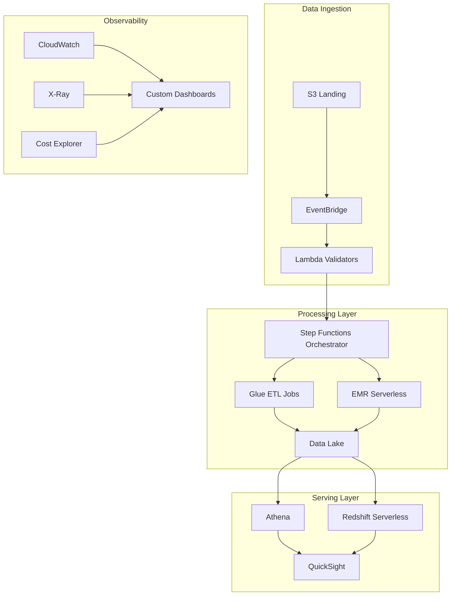

# Project 3: ATO Serverless Data Platform
## Australian Taxation Office (2022)

### Executive Summary
Architected and delivered a serverless data platform processing **100TB daily** with 99% uptime, supporting tax compliance analytics and fraud detection.

### Problem Statement
- Legacy on-premise infrastructure couldn't scale for tax time peaks
- 10x data volume during July-October period
- Manual ETL processes taking days to complete
- Limited observability into data pipeline health

### Solution Architecture



### Key Implementation Highlights

```python
# Step Functions State Machine Definition
class TaxDataPipeline:
    def __init__(self):
        self.state_machine = {
            "Comment": "Tax data processing pipeline",
            "StartAt": "ValidateInput",
            "States": {
                "ValidateInput": {
                    "Type": "Task",
                    "Resource": "arn:aws:lambda:validate-input",
                    "Retry": [{
                        "ErrorEquals": ["States.TaskFailed"],
                        "IntervalSeconds": 2,
                        "MaxAttempts": 3,
                        "BackoffRate": 2.0
                    }],
                    "Next": "DetermineProcessingPath"
                },
                "DetermineProcessingPath": {
                    "Type": "Choice",
                    "Choices": [
                        {
                            "Variable": "$.dataSize",
                            "NumericGreaterThan": 1000000000,
                            "Next": "ProcessWithEMR"
                        },
                        {
                            "Variable": "$.dataType",
                            "StringEquals": "structured",
                            "Next": "ProcessWithGlue"
                        }
                    ],
                    "Default": "ProcessWithGlue"
                },
                "ProcessWithEMR": {
                    "Type": "Task",
                    "Resource": "arn:aws:states:::emr-serverless:startJobRun.sync",
                    "Parameters": {
                        "ApplicationId": "emr-app-id",
                        "ExecutionRoleArn": "role-arn",
                        "JobDriver": {
                            "SparkSubmit": {
                                "EntryPoint": "s3://scripts/process_large_dataset.py"
                            }
                        }
                    },
                    "Next": "DataQualityCheck"
                }
            }
        }
```

### Observability & Monitoring Framework

```yaml
Metrics Tracked:
  Performance:
    - Pipeline execution time (p50, p90, p99)
    - Data processing throughput (GB/min)
    - Error rates by stage
    - Queue depths and lag

  Cost:
    - Cost per GB processed
    - Resource utilization efficiency
    - Spot instance savings
    - Reserved capacity usage

  Quality:
    - Data completeness scores
    - Schema drift detection
    - Anomaly detection on key metrics
    - Compliance validation results

Alerting:
  Critical:
    - Pipeline failures > 3 consecutive
    - Data delay > 2 hours
    - Cost spike > 150% baseline

  Warning:
    - Processing time > p95 historical
    - Error rate > 1%
    - Schema changes detected
```

### Infrastructure as Code

```terraform
# Terraform configuration for core components
resource "aws_stepfunctions_state_machine" "tax_pipeline" {
  name     = "tax-data-pipeline"
  role_arn = aws_iam_role.step_function_role.arn

  definition = jsonencode({
    Comment = "Tax data processing orchestration"
    StartAt = "ValidateAndRoute"
    # ... state machine definition
  })

  logging_configuration {
    level            = "ALL"
    include_execution_data = true
    log_destination  = aws_cloudwatch_log_group.step_functions.arn
  }

  tracing_configuration {
    enabled = true
  }
}

# Auto-scaling configuration
resource "aws_applicationautoscaling_target" "glue_dpu" {
  max_capacity       = 1000
  min_capacity       = 10
  resource_id        = "glue:job:tax-processor"
  scalable_dimension = "glue:job:DPU"

  # Scale based on processing backlog
  target_tracking_scaling_policy_configuration {
    target_value = 100.0
    metric_type  = "custom"

    custom_metric {
      name      = "ProcessingBacklog"
      namespace = "TaxPipeline"
    }
  }
}
```

### Impact Metrics

- **100TB daily processing** capacity (10x improvement)
- **99% uptime** during peak tax season
- **72% cost reduction** vs on-premise solution
- **Real-time fraud detection** (previously batch daily)
- **6-hour to 15-minute** report generation

### Advanced Features Implemented

1. **Multi-Region Disaster Recovery**
   - Active-passive setup across Sydney and Melbourne regions
   - 15-minute RTO, 1-hour RPO
   - Automated failover testing monthly

2. **Cost Optimization**
   - Intelligent compute selection (Lambda vs Glue vs EMR)
   - Spot instance usage for non-critical workloads
   - S3 lifecycle policies with Intelligent-Tiering

3. **Security & Compliance**
   - End-to-end encryption with KMS
   - VPC endpoints for private connectivity
   - Detailed audit logging for compliance
   - Data retention policies automated

### Connection to Pragia/IRIS

This project demonstrates:
- **Massive scale operations**: Handling 100TB daily aligns with IR's enterprise scale
- **Observability excellence**: Built comprehensive monitoring before issues arise
- **Serverless expertise**: Cost-effective, scalable architecture
- **Government-grade compliance**: Strictest security and audit requirements

### Lessons Learned

1. **Observability first**: Instrumented everything before going live
2. **Cost as a metric**: Treated cost optimization as a feature, not afterthought
3. **Gradual migration**: Ran shadow mode for 3 months before cutover
4. **Automation everything**: Even DR testing and cost reviews automated

### Performance Optimization Techniques

- **Partition pruning**: Reduced Athena query costs by 80%
- **Compression selection**: Tested Snappy vs Gzip vs Zstd for optimal balance
- **Broadcast joins**: Optimized Spark jobs for skewed datasets
- **Incremental processing**: Delta Lake for efficient updates