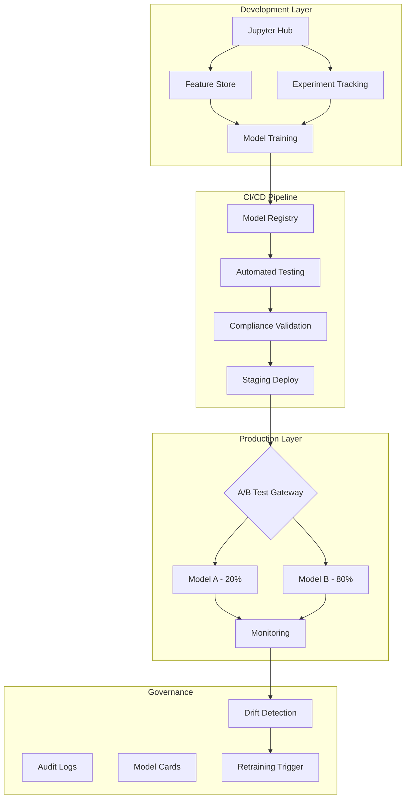

# Project 4: MLOps Platform Transformation
## Pepper Money (2024)

### Executive Summary
Led the design and implementation of a self-serve MLOps platform that reduced model deployment time from **weeks to hours** while ensuring compliance and governance.

### Problem Statement
- Data scientists waiting weeks for model deployment
- No standardized model lifecycle management
- Inconsistent monitoring and drift detection
- Manual compliance documentation for each model
- Feature engineering code duplicated across teams

### Platform Architecture



### Key Components Implementation

#### 1. Feature Store Architecture

```python
class FeatureStore:
    def __init__(self):
        self.offline_store = SnowflakeOfflineStore()
        self.online_store = RedisOnlineStore()
        self.feature_registry = FeatureRegistry()

    def register_feature(self, feature_definition: FeatureDefinition):
        """Register a new feature with schema validation"""
        # Validate schema
        self._validate_schema(feature_definition)

        # Register transformations
        self.feature_registry.register(
            name=feature_definition.name,
            source=feature_definition.source,
            transformation=feature_definition.transformation,
            owners=feature_definition.owners,
            sla=feature_definition.sla
        )

        # Setup monitoring
        self._setup_monitoring(feature_definition)

        # Create materialization jobs
        self._create_materialization_pipeline(feature_definition)

    def get_training_data(self, feature_list: List[str],
                         entity_df: pd.DataFrame) -> pd.DataFrame:
        """Point-in-time correct feature retrieval"""
        return self.offline_store.get_historical_features(
            entity_df=entity_df,
            features=feature_list,
            point_in_time_correct=True
        )
```

#### 2. Model Registry & Lifecycle Management

```python
class ModelRegistry:
    def __init__(self):
        self.mlflow_client = mlflow.tracking.MlflowClient()
        self.governance_db = GovernanceDatabase()

    def register_model(self, model_artifacts: Dict, metadata: ModelMetadata):
        # Create model card
        model_card = self._generate_model_card(metadata)

        # Run automated tests
        test_results = self._run_validation_suite(model_artifacts)

        # Check compliance
        compliance_check = self._validate_compliance(metadata, test_results)

        if not compliance_check.passed:
            raise ComplianceException(compliance_check.failures)

        # Register in MLflow
        model_version = mlflow.register_model(
            model_uri=model_artifacts['uri'],
            name=metadata.name,
            tags={
                'risk_score': metadata.risk_score,
                'data_sources': metadata.data_sources,
                'feature_list': metadata.features,
                'performance_metrics': test_results.metrics
            }
        )

        # Setup monitoring
        self._configure_monitoring(model_version)

        return model_version
```

#### 3. Drift Detection & Monitoring

```python
class DriftMonitor:
    def __init__(self, model_id: str):
        self.model_id = model_id
        self.baseline = self._load_baseline()
        self.alert_manager = AlertManager()

    def check_drift(self, production_data: pd.DataFrame):
        drift_results = {
            'data_drift': self._check_data_drift(production_data),
            'prediction_drift': self._check_prediction_drift(production_data),
            'performance_drift': self._check_performance_drift(production_data)
        }

        for drift_type, result in drift_results.items():
            if result.is_significant:
                self.alert_manager.send_alert(
                    level='WARNING' if result.severity < 0.8 else 'CRITICAL',
                    message=f"{drift_type} detected for model {self.model_id}",
                    details=result.to_dict(),
                    suggested_action=self._get_remediation(drift_type, result)
                )

        return drift_results

    def _check_data_drift(self, data: pd.DataFrame):
        # KS test for numerical features
        # Chi-square for categorical
        # Population Stability Index (PSI)
        return DataDriftResult(...)
```

### Platform Capabilities

#### Self-Service Features
- **One-click deployment**: From notebook to production
- **Automated feature engineering**: Reusable transformation pipelines
- **Experiment tracking**: Automatic capture of all parameters and metrics
- **Model comparison**: Side-by-side performance analysis

#### Governance & Compliance
- **Automated model cards**: Generated from metadata
- **Audit trail**: Every model decision logged
- **GDPR compliance**: Data lineage and deletion capabilities
- **Risk scoring**: Automatic assessment based on data sensitivity

#### Infrastructure
```yaml
Infrastructure Stack:
  Compute:
    - Kubernetes (EKS) for model serving
    - Spark on EMR for batch predictions
    - Lambda for real-time inference

  Storage:
    - S3 for model artifacts
    - DynamoDB for feature store metadata
    - Snowflake for offline features
    - Redis for online features

  ML Tools:
    - MLflow for experiment tracking
    - Feast for feature store
    - Seldon Core for model serving
    - Great Expectations for data validation

  Monitoring:
    - Prometheus + Grafana for metrics
    - WhyLabs for drift detection
    - Custom dashboards for business KPIs
```

### Impact Metrics

#### Before vs After
| Metric | Before | After | Improvement |
|--------|--------|-------|------------|
| Model Deployment Time | 3-4 weeks | 4-6 hours | **98% reduction** |
| Feature Reuse | <5% | 67% | **13x increase** |
| Models in Production | 3 | 27 | **9x increase** |
| Compliance Documentation | Manual (2 days) | Automated (instant) | **100% automation** |
| Drift Detection | Monthly manual | Real-time automated | **720x faster** |
| A/B Test Setup | 1 week | 30 minutes | **99.7% reduction** |

### Cost Optimization Achieved
- **60% reduction** in compute costs through intelligent resource allocation
- **$500K annual savings** from feature reuse
- **80% reduction** in data scientist idle time

### ISO 42001 Preparation Elements
1. **Risk Management Framework**: Built-in risk scoring for all models
2. **Transparency Requirements**: Automated model cards with explanations
3. **Human Oversight**: Approval workflows for high-risk models
4. **Performance Monitoring**: Continuous tracking against baselines
5. **Data Governance**: Full lineage tracking and quality checks

### Connection to Pragia/IRIS

This platform demonstrates:
- **Platform mindset**: Enabling others to build and deploy quickly
- **Production ML maturity**: Handling model lifecycle end-to-end
- **Observability focus**: Comprehensive monitoring before issues arise
- **Compliance readiness**: Built for regulated environment (financial services)

### Key Innovations

1. **"Thin Slice" Deployment Strategy**
   - Started with single model, single use case
   - Iteratively added capabilities based on user feedback
   - Full platform in 6 months with continuous value delivery

2. **Shadow Mode Testing**
   - All models run in shadow for 2 weeks before promotion
   - Automatic performance comparison with production
   - Risk-free testing with real data

3. **Feature Store as Competitive Advantage**
   - 200+ features available for immediate use
   - Automatic backfilling for new features
   - Point-in-time correctness guaranteed

### Lessons Learned

1. **Start with the workflow, not the technology**
2. **Make the right thing the easy thing**
3. **Instrument everything from day one**
4. **Build trust through transparency and quick wins**