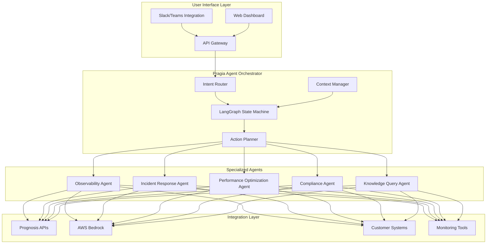

# Agentic Systems Architecture Deep Dive
## Design for Pragia using LangGraph

### Overall System Architecture



### LangGraph State Machine Design

```python
from typing import TypedDict, List, Optional, Annotated
from langgraph.graph import StateGraph, END
from langchain.schema import BaseMessage

class PragiaState(TypedDict):
    """Core state for Pragia agent orchestration"""
    # Conversation context
    messages: Annotated[List[BaseMessage], "append"]
    user_intent: str
    conversation_id: str

    # System context
    current_system_state: dict  # Real-time metrics from Prognosis
    alert_context: Optional[dict]  # Active alerts/incidents
    historical_context: List[dict]  # Recent similar issues

    # Planning
    action_plan: List[dict]  # Sequence of actions to take
    current_action_index: int
    execution_results: List[dict]

    # Permissions & Compliance
    user_role: str
    authorized_actions: List[str]
    compliance_requirements: List[str]

    # Multi-modal data
    metrics_snapshot: dict
    log_excerpts: List[str]
    dashboard_images: Optional[List[bytes]]

    # Decision tracking
    confidence_scores: dict
    reasoning_chain: List[str]
    human_approval_required: bool

class PragiaOrchestrator:
    def __init__(self):
        self.graph = self._build_orchestration_graph()
        self.memory = ConversationMemory()  # Long-term memory
        self.action_registry = ActionRegistry()  # Available actions

    def _build_orchestration_graph(self) -> StateGraph:
        workflow = StateGraph(PragiaState)

        # Core nodes
        workflow.add_node("understand_context", self.understand_context)
        workflow.add_node("assess_situation", self.assess_situation)
        workflow.add_node("plan_actions", self.plan_actions)
        workflow.add_node("validate_plan", self.validate_plan)
        workflow.add_node("execute_action", self.execute_action)
        workflow.add_node("monitor_execution", self.monitor_execution)
        workflow.add_node("human_approval", self.human_approval)
        workflow.add_node("update_knowledge", self.update_knowledge)

        # Entry point
        workflow.set_entry_point("understand_context")

        # Conditional edges
        workflow.add_conditional_edges(
            "assess_situation",
            self._route_by_severity,
            {
                "critical": "plan_actions",
                "monitoring": "monitor_execution",
                "informational": END
            }
        )

        workflow.add_conditional_edges(
            "validate_plan",
            self._check_human_approval,
            {
                "required": "human_approval",
                "not_required": "execute_action"
            }
        )

        workflow.add_edge("execute_action", "monitor_execution")
        workflow.add_edge("monitor_execution", "update_knowledge")

        return workflow.compile()

    async def understand_context(self, state: PragiaState) -> PragiaState:
        """Enriches context with system state and historical data"""
        # Pull real-time metrics from Prognosis
        state["current_system_state"] = await self._fetch_system_metrics()

        # Search for similar historical issues
        state["historical_context"] = await self._search_similar_issues(
            state["messages"][-1].content
        )

        # Extract intent using Claude
        state["user_intent"] = await self._classify_intent(state)

        return state

    async def plan_actions(self, state: PragiaState) -> PragiaState:
        """Creates detailed action plan"""
        prompt = f"""
        Given the current situation:
        - User Intent: {state['user_intent']}
        - System State: {state['current_system_state']}
        - Historical Context: {state['historical_context']}

        Create a detailed action plan with:
        1. Specific steps to address the issue
        2. Expected outcomes for each step
        3. Rollback procedures if needed
        4. Success criteria
        """

        plan = await self.llm.generate_plan(prompt, state)
        state["action_plan"] = plan
        state["human_approval_required"] = self._requires_approval(plan)

        return state
```

### Memory and Context Management

```python
class ContextManager:
    """Manages conversation context and system state"""

    def __init__(self):
        self.short_term_memory = {}  # Current conversation
        self.long_term_memory = VectorStore()  # Historical knowledge
        self.active_contexts = {}  # System-wide context

    def build_context_window(self, conversation_id: str) -> dict:
        """Builds relevant context for current interaction"""
        return {
            "conversation_history": self.short_term_memory.get(conversation_id, []),
            "relevant_documentation": self._retrieve_relevant_docs(),
            "system_topology": self._get_system_topology(),
            "recent_changes": self._get_recent_changes(),
            "active_incidents": self._get_active_incidents(),
            "user_preferences": self._get_user_preferences()
        }

    def update_knowledge_base(self, execution_result: dict):
        """Updates long-term memory with new learnings"""
        # Extract key insights
        insights = self._extract_insights(execution_result)

        # Store in vector database for future retrieval
        for insight in insights:
            self.long_term_memory.add(
                content=insight["content"],
                metadata={
                    "timestamp": datetime.now(),
                    "effectiveness_score": insight["score"],
                    "applicable_scenarios": insight["scenarios"]
                }
            )

    def _retrieve_relevant_docs(self, query: str, k: int = 5) -> List[dict]:
        """Retrieves relevant documentation and runbooks"""
        return self.long_term_memory.similarity_search(query, k=k)
```

### Multi-Modal Data Integration

```python
class MultiModalProcessor:
    """Handles diverse data types for Pragia"""

    def __init__(self):
        self.metric_processor = MetricProcessor()
        self.log_processor = LogProcessor()
        self.image_processor = ImageProcessor()  # For dashboards

    async def process_observability_data(self, source: str) -> dict:
        """Processes data from various observability sources"""

        processors = {
            "metrics": self._process_metrics,
            "logs": self._process_logs,
            "traces": self._process_traces,
            "dashboards": self._process_dashboards
        }

        results = {}
        for data_type, processor in processors.items():
            results[data_type] = await processor(source)

        # Correlate across data types
        correlations = self._correlate_signals(results)

        return {
            "raw_data": results,
            "correlations": correlations,
            "anomalies": self._detect_anomalies(results),
            "summary": self._generate_summary(results, correlations)
        }

    def _detect_anomalies(self, data: dict) -> List[dict]:
        """Detects anomalies across multiple data sources"""
        anomalies = []

        # Time series anomalies in metrics
        if "metrics" in data:
            metric_anomalies = self._detect_metric_anomalies(data["metrics"])
            anomalies.extend(metric_anomalies)

        # Pattern anomalies in logs
        if "logs" in data:
            log_anomalies = self._detect_log_patterns(data["logs"])
            anomalies.extend(log_anomalies)

        # Correlate anomalies across sources
        correlated = self._correlate_anomalies(anomalies)

        return correlated
```

### Action Execution Framework

```python
class ActionExecutor:
    """Executes planned actions with safety controls"""

    def __init__(self):
        self.action_registry = self._load_action_registry()
        self.safety_checker = SafetyChecker()
        self.rollback_manager = RollbackManager()

    async def execute_action(self, action: dict, state: PragiaState) -> dict:
        """Safely executes an action with monitoring"""

        # Pre-execution validation
        validation = self.safety_checker.validate(action, state)
        if not validation.is_safe:
            return {
                "status": "blocked",
                "reason": validation.reason,
                "suggested_alternative": validation.alternative
            }

        # Create rollback point
        rollback_id = self.rollback_manager.create_checkpoint(state)

        try:
            # Execute with monitoring
            result = await self._execute_with_monitoring(action, state)

            # Verify success criteria
            if self._verify_success(result, action["success_criteria"]):
                return {
                    "status": "success",
                    "result": result,
                    "metrics": self._collect_metrics(result)
                }
            else:
                # Automatic rollback if criteria not met
                await self.rollback_manager.rollback(rollback_id)
                return {
                    "status": "failed",
                    "result": result,
                    "rollback_executed": True
                }

        except Exception as e:
            # Emergency rollback
            await self.rollback_manager.rollback(rollback_id)
            return {
                "status": "error",
                "error": str(e),
                "rollback_executed": True
            }

    async def _execute_with_monitoring(self, action: dict, state: PragiaState):
        """Executes action while monitoring system health"""

        # Start monitoring thread
        monitor_task = asyncio.create_task(
            self._monitor_system_health(action["monitoring_config"])
        )

        # Execute the action
        executor = self.action_registry.get_executor(action["type"])
        result = await executor.execute(action["parameters"], state)

        # Stop monitoring
        monitor_task.cancel()

        return result
```

### Scaling Considerations

```yaml
Scaling Strategy:
  Horizontal Scaling:
    - Stateless agent design
    - Queue-based job distribution
    - Read replicas for knowledge base

  Performance Optimization:
    - Response caching for common queries
    - Parallel agent execution
    - Lazy loading of context
    - Streaming responses for long operations

  Resource Management:
    - Dynamic agent pool sizing
    - Priority-based queue processing
    - Circuit breakers for external services
    - Cost-aware LLM model selection

  High Availability:
    - Multi-region deployment
    - State replication
    - Graceful degradation
    - Automatic failover
```

### Integration Points with IR Systems

```python
class IRSystemsIntegration:
    """Integration layer for IR's existing systems"""

    def __init__(self):
        self.prognosis_client = PrognosisAPIClient()
        self.elevate_connector = ElevateConnector()
        self.customer_systems = CustomerSystemsAdapter()

    async def fetch_unified_observability_data(self) -> dict:
        """Fetches data from all IR monitoring systems"""

        # Parallel fetch from all sources
        tasks = [
            self.prognosis_client.get_uc_metrics(),  # UC&C monitoring
            self.prognosis_client.get_payment_metrics(),  # Payment systems
            self.elevate_connector.get_aws_metrics(),  # Cloud metrics
            self.customer_systems.get_custom_metrics()  # Customer-specific
        ]

        results = await asyncio.gather(*tasks)

        # Normalize and combine
        unified_data = self._normalize_data_formats(results)

        return unified_data

    def translate_to_action(self, pragia_action: dict) -> dict:
        """Translates Pragia action to system-specific commands"""

        translations = {
            "restart_service": self._translate_restart,
            "scale_resources": self._translate_scaling,
            "update_configuration": self._translate_config_update,
            "trigger_failover": self._translate_failover
        }

        translator = translations.get(pragia_action["type"])
        if translator:
            return translator(pragia_action)
        else:
            raise ValueError(f"Unknown action type: {pragia_action['type']}")
```